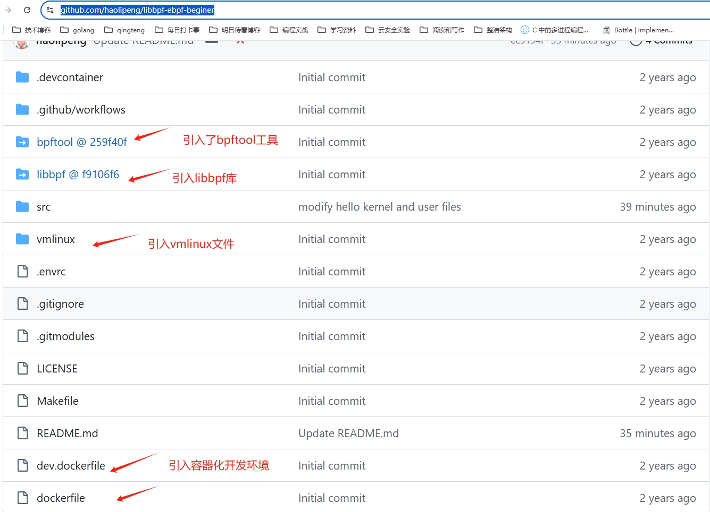

# Lesson 1: eBPF Hello World

## 一、什么是 eBPF？

eBPF（extended Berkeley Packet Filter）是一项革命性的内核技术，允许在内核中安全地运行用户定义的程序，无需修改内核源码或加载内核模块。


**核心价值：**

- **可观测性**：追踪系统调用、函数执行、性能分析
- **网络**：高性能数据包处理、负载均衡、防火墙
- **安全**：运行时安全监控、异常行为检测

eBPF 程序分为**内核态**和**用户态**两部分：内核态程序运行在内核中捕获事件，用户态程序负责加载、管理和处理数据。

## 二、环境准备

### 2.1 系统要求

**推荐使用 Ubuntu 24.04**（内核 6.8+），可体验更完整的 eBPF 特性。

```bash
# 检查内核版本
uname -r
```

### 2.2 安装依赖

```bash
sudo apt update
sudo apt install -y clang llvm libelf-dev libbpf-dev linux-headers-$(uname -r) \
    build-essential pkg-config zlib1g-dev
```

### 2.3 克隆项目

```bash
git clone --recursive https://github.com/haolipeng/libbpf-ebpf-beginer.git
cd libbpf-ebpf-beginer
```

> **注意**：`--recursive` 参数会同时拉取 libbpf、bpftool 等子模块。

下载下来的项目概况如下图所示：



## 三、eBPF 内核态编码

内核态代码文件：`src/helloworld/helloworld.bpf.c`

```c
#include "vmlinux.h"
#include <bpf/bpf_helpers.h>
#include <bpf/bpf_tracing.h>
#include <bpf/bpf_core_read.h>

char LICENSE[] SEC("license") = "Dual BSD/GPL";

// 类型定义
typedef unsigned int u32;
typedef int pid_t;

// 创建 BPF Map，用于用户态和内核态之间传递数据
struct {
    __uint(type, BPF_MAP_TYPE_ARRAY);
    __uint(max_entries, 1);
    __type(key, u32);
    __type(value, pid_t);
} my_pid_map SEC(".maps");

// 挂载到 write 系统调用的入口 tracepoint
SEC("tp/syscalls/sys_enter_write")
int handle_tp(void *ctx)
{
    u32 index = 0;
    // 获取当前进程 PID（高32位是PID，低32位是TID）
    pid_t pid = bpf_get_current_pid_tgid() >> 32;

    // 从 Map 中读取目标 PID
    pid_t *my_pid = bpf_map_lookup_elem(&my_pid_map, &index);

    // 只处理目标进程的 write 调用
    if (!my_pid || *my_pid != pid)
        return 1;

    bpf_printk("BPF triggered from PID %d.\n", pid);

    return 0;
}
```

### 代码解析

| 代码 | 说明 |
|------|------|
| `#include "vmlinux.h"` | 包含内核数据结构定义（由 bpftool 生成） |
| `SEC("license")` | 声明许可证，GPL 兼容才能使用部分内核函数 |
| `SEC(".maps")` | 定义 BPF Map，用于内核态与用户态数据共享 |
| `SEC("tp/syscalls/sys_enter_write")` | 挂载点：write 系统调用入口的 tracepoint |
| `bpf_get_current_pid_tgid()` | 获取当前进程/线程 ID，右移 32 位取 PID |
| `bpf_map_lookup_elem()` | 从 Map 中查找元素 |
| `bpf_printk()` | 输出调试信息到 trace_pipe |

我们能看到挂载点为"tp/syscalls/sys_enter_write"

### 如何查找可用的挂载点？

使用 `bpftrace` 工具查询：

```bash
# 查询所有系统调用 tracepoint
sudo bpftrace -l 'tracepoint:syscalls:*'

# 查询 write 相关
sudo bpftrace -l 'tracepoint:syscalls:*write*'
```

其命令执行结果如下：

```
root@ebpf-machine:/home/work/ebpf-tutorial/docs/zh/guide# bpftrace -l 'tracepoint:syscalls:*write*'
tracepoint:syscalls:sys_enter_process_vm_writev
tracepoint:syscalls:sys_enter_pwrite64
tracepoint:syscalls:sys_enter_pwritev
tracepoint:syscalls:sys_enter_pwritev2
tracepoint:syscalls:sys_enter_write
tracepoint:syscalls:sys_enter_writev
tracepoint:syscalls:sys_exit_process_vm_writev
tracepoint:syscalls:sys_exit_pwrite64
tracepoint:syscalls:sys_exit_pwritev
tracepoint:syscalls:sys_exit_pwritev2
tracepoint:syscalls:sys_exit_write
tracepoint:syscalls:sys_exit_writev
root@ebpf-machine:/home/work/ebpf-tutorial/docs/zh/guide# 
```


## 四、eBPF 用户态编码

用户态代码文件：`src/helloworld/helloworld.c`

```c
#include <stdio.h>
#include <unistd.h>
#include <sys/resource.h>
#include <bpf/libbpf.h>
#include "helloworld.skel.h"

// libbpf 日志回调函数
static int libbpf_print_fn(enum libbpf_print_level level, const char *format, va_list args)
{
    return vfprintf(stderr, format, args);
}

int main(int argc, char **argv)
{
    struct helloworld_bpf *skel;
    int err;
    pid_t pid;
    unsigned index = 0;

    // 1. 设置 libbpf 严格模式和日志回调
    libbpf_set_strict_mode(LIBBPF_STRICT_ALL);
    libbpf_set_print(libbpf_print_fn);

    // 2. 打开 BPF 程序
    skel = helloworld_bpf__open();
    if (!skel) {
        fprintf(stderr, "Failed to open BPF skeleton\n");
        return 1;
    }

    // 3. 加载并验证 BPF 程序
    err = helloworld_bpf__load(skel);
    if (err) {
        fprintf(stderr, "Failed to load BPF skeleton\n");
        goto cleanup;
    }

    // 4. 将当前进程 PID 写入 Map，让内核态只追踪本进程
    pid = getpid();
    err = bpf_map__update_elem(skel->maps.my_pid_map, &index, sizeof(index),
                                &pid, sizeof(pid_t), BPF_ANY);
    if (err < 0) {
        fprintf(stderr, "Error updating map: %s\n", strerror(-err));
        goto cleanup;
    }

    // 5. 附加 BPF 程序到挂载点
    err = helloworld_bpf__attach(skel);
    if (err) {
        fprintf(stderr, "Failed to attach BPF skeleton\n");
        goto cleanup;
    }

    // 6. 读取 trace_pipe 输出
    printf("Successfully started! Reading trace_pipe...\n");
    system("sudo cat /sys/kernel/debug/tracing/trace_pipe");

cleanup:
    // 7. 清理资源
    helloworld_bpf__destroy(skel);
    return err < 0 ? -err : 0;
}
```

### Skeleton 机制说明

`helloworld.skel.h` 是编译时自动生成的"骨架"文件，提供了类型安全的 API：

| API | 功能 |
|-----|------|
| `helloworld_bpf__open()` | 打开 BPF 对象 |
| `helloworld_bpf__load()` | 加载到内核并验证 |
| `helloworld_bpf__attach()` | 附加到挂载点 |
| `helloworld_bpf__destroy()` | 销毁并释放资源 |
| `skel->maps.my_pid_map` | 访问定义的 Map |

### 用户态程序流程

```
open() → load() → update_map() → attach() → 运行 → destroy()
```

## 五、编译与运行

### 5.1 编译

```bash
# 进入项目根目录
cd libbpf-ebpf-beginer

# 首次编译：构建 libbpf 和 bpftool
make prebuild

# 编译 helloworld 示例
make helloworld
```

编译成功后，可执行文件位于 `src/helloworld/helloworld`。

### 5.2 运行

```bash
# 需要 root 权限
sudo ./src/helloworld/helloworld
```

### 5.3 验证输出

程序运行后会显示：

```
Successfully started! Reading trace_pipe...
```

然后每当程序执行 write 系统调用时，会输出类似：

```
<...>-12345  [001] d... 12345.678901: bpf_trace_printk: BPF triggered from PID 12345.
```

### 5.4 使用 bpftool 验证

在另一个终端查看已加载的 BPF 程序：

```bash
sudo bpftool prog list
sudo bpftool map list
```

## 六、常见问题 FAQ

### Q1: 编译报错 "vmlinux.h: No such file"

**原因**：未生成 vmlinux.h 文件

**解决**：
```bash
make prebuild
```

### Q2: 运行报错 "Operation not permitted"

**原因**：权限不足

**解决**：使用 `sudo` 运行程序

### Q3: 运行报错 "libbpf: failed to find BTF"

**原因**：内核未启用 BTF 支持

**解决**：
```bash
# 检查 BTF 是否启用
ls /sys/kernel/btf/vmlinux

# 如不存在，需要升级内核或安装支持 BTF 的内核
```

### Q4: trace_pipe 没有输出

**原因**：可能是 PID 过滤导致

**排查**：
```bash
# 直接查看 trace_pipe（会显示所有 eBPF 输出）
sudo cat /sys/kernel/debug/tracing/trace_pipe
```

### Q5: 如何退出程序？

按 `Ctrl+C` 终止程序。

---

**源代码地址**：
- [helloworld.bpf.c](https://github.com/haolipeng/libbpf-ebpf-beginer/blob/master/src/helloworld/helloworld.bpf.c)
- [helloworld.c](https://github.com/haolipeng/libbpf-ebpf-beginer/blob/master/src/helloworld/helloworld.c)
